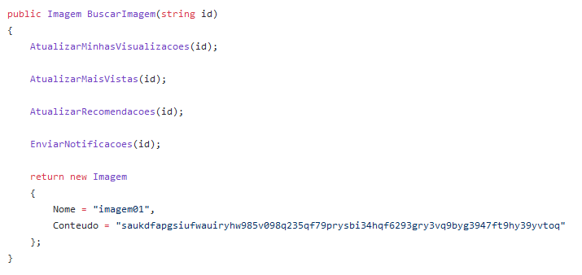

# Microserviços & Rabbitmq

## No inicio...

Temos uma api de visualizacao de imagens, que no início era assim:


Tudo ok. retorna uma imagem, bem simples ;)

## Novas features

Com a passagem do tempo, implementandos algumas features, basedas em rankings e recomendações:



## Sinal amarelo!

Agora nossa chamada esta fazendo coisas que nao importam muito para o cliente, pelo menos não em *tempo real*. todas essas ações pode sem feitas de maneira *assincrona*, liberando a chamada na api para fazer quase exclusivamente o cliente esta pedindo: retornar uma imagem.

Removendo essas lógicas de "relatórios", deixamos a api mais performática para o cliente e removemos algum pontos de falhas na api. Agora vamos começar a entrar nos *microserviços*.

## RabbitMQ

Então, o que faremos?

Quando for solicitado uma imagem, vamos disperar um *evento* chamado *VisualizacaoImagem*. esse evento será enviado para o rabbitmq, e outro servico irá *consumir* essa evento, processando todas as regras que removemos do fluxo da api.


nosso evento vai conter somente o ID da imagem (o nome no caso), que é o que nossos métodos precisam.


## Configurando a solução até agora...

Vamos usar o cliente *Masstransit* para fazer a comunicação com rabbitmq, pois ele já vem com umas features bem legais que facilita bastante a vida:

Pacotes Nugets necessários:

```
<PackageReference Include="MassTransit" Version="7.0.6" />
<PackageReference Include="MassTransit.AspNetCore" Version="7.0.6" />
<PackageReference Include="MassTransit.RabbitMQ" Version="7.0.6" />
```

no *startup.cs* configuramos da seguiente maneira:


Com isso já é injentado a classe *IBusControl* no container do net core. Essa é a classe usada para enviar os eventos para o *broker* (RabbitMQ é um *Message Broker*), conforme o exemplo mais acima.

o nosso servico que irá consumir as mensagens será um *Console Application*, com os seguintes pacotes:

```
<PackageReference Include="MassTransit" Version="7.0.6" />
<PackageReference Include="MassTransit.RabbitMQ" Version="7.0.6" />
```

e com as seguintes configurações:


a configuração é semelhanta a da API, com a adição do *ReceiveEndpoint*, que configura a classe *ProcessarVisualizacaoImagem*, a qual possui todo lógica extraida da API:


## Explicando melhor o RabbitMQ

Bom, agora vamos explicar um pouco melhor como funciona o rabbitmq e o masstransit.

Vamos subir um *rabbit* rapidamendo com docker:
```
docker run -p 5672:5672 -p 15672:15672 rabbitmq:3.8.9-management
```

A porta 5672 é usada para o envio e recebimento de mensagens, que já padrão no nosso cliente, enquanto a 15672 é UI.


Temos duas entidades principais, o *Exchange* e a *Queue*. Na hora de publicar uma mensagem, ela é publicada em um *Exchange*, e é ele que envia para a *Queue*.

Utilizando o *MassTransit*, já é criado um *Exchange* igual ao *namespace* do objeto de envio na hora que é publicada a mensagem. Quando um consumidor é conectado, é criada a fila configurada no *ReceiveEndpoint* (*visualicacao.imagem* no exemplo) e é feito também o *bind* com o exchange.

> _*o "grude" acontece pelo objeto da mensagem, que tem que ser igual, inclusive o namespace, no produtor e no consumidor, assim o consumidor sabe qual mensagem tem que processar, em um caso onde existe muitos tipo de mensagens*_

assim temos a *Queue*:


o *Exchange*:


e o *Binding*:

