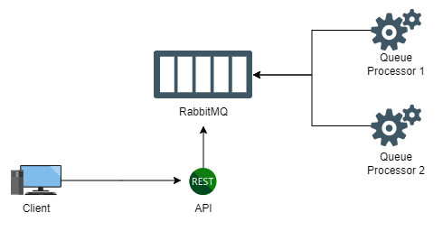
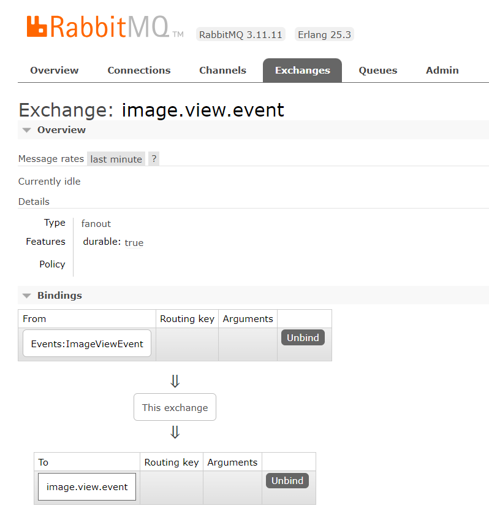

# Scaling your App with RabbitMQ

## At the beginning...

We have an image viewing API, which at first looked like this:


Everything is OK. returns an image. Pretty simple, right?

## New features

Over time, we implemented some new features, based on rankings and recommendations:


## Does this feel right?

Now our call is doing things that don't really matter to the customer, at least not in *real time*. All of these actions can be done *asynchronously*, freeing the api call to do almost exclusively what the client is asking for: return an image.

By removing these "reporting" logics, we make the API more performant for the client and remove some points of failure in the API.

## RabbitMQ

So what will we do?

When an image is requested, we will trigger an *event* called *ImageViewEvent*. this event will be sent to RabbitMQ, and another service will *consume* this event, processing all the rules we removed from the API stream.


Our event will only contain the image ID, which is what our new methods will need.


## Configuring the solution so far...

Let's use the *Masstransit* client to communicate with rabbitmq, as it already comes with some really cool features that make life a lot easier:

Required Nugets packages:

```
<PackageReference Include="MassTransit" Version="8.3.1" />
<PackageReference Include="MassTransit.AspNetCore" Version="7.3.1" />
<PackageReference Include="MassTransit.RabbitMQ" Version="8.3.1" />
```

in *startup.cs* we configure it as follows:


With this, the *IBusControl* class is already injected into the net core dependency injection container. This is the class used to send events to RabbitMQ, as shown in the example above.

Our service that will consume the messages will be a *Console Application*, with the following packages:

```
<PackageReference Include="MassTransit" Version="8.3.1" />
<PackageReference Include="MassTransit.RabbitMQ" Version="8.3.1" />
```

and with the following settings:


The configuration is similar to the API, with the addition of *ReceiveEndpoint*, which configures the *ImageViewProcessor* class, which has all the logic extracted from the API:


Our class that will process the event must implement the *IConsumer* interface, passing the object we want to process.

## Horizontal scalability

We were also able to horizontally scale rule processing. You can just run other instance of the same version of our service.
The two services will be listening to the same queue, and rabbitmq itself will distribute the messages to consumers appropriately (*round-robin* for example), achieving parallel processing.



RabbitMQ guarantees that the same message does not go to the same consumer.

## Explaining RabbitMQ better

Well, now let's explain a little better how rabbitmq and masstransit work.

Let's quickly run *RabbitMQ* with Docker:
```
docker run -p 5672:5672 -p 15672:15672 rabbitmq:3.8.9-management
```
The port 5672 is used for sending and receiving messages, which is already standard in our client, while 15672 is the UI port.


We have two main entities, the *Exchange* and the *Queue*. When publishing a message, it is published on an *Exchange*, and it is sent to the *Queue*.

Using *MassTransit*, an *Exchange* equal to the *namespace* of the sending object is already created at the time the message is published. When a consumer is connected, the queue configured in the *ReceiveEndpoint* (*image.view* in the example) is created and the *bind* with the exchange is also done.

> _*the "bind" happens through the message object, which has to be the same, including the namespace, in the producer and consumer, so the consumer knows which message has to be processed.*_

so we have the *Queue*:


the *Exchange*:


and the *Binding*:



It's starting to look good! We started with an *event-driven architecture* and *asynchronous* and parallel processing. We also don't need to worry too much about service downtime, as the messages will continue in the queue, and when the service goes up, it will consume the messages.

## And the errors?

the *masstransit* provides us with features that make error handling easier. Let's look at *Retries* and *CircuitBreaker*.

When an *exception* happens in our consumer, the message goes to an *_error* queue, for example:


With *retries* we can configure retries. for example: 5 attempts at 1 second intervals. Only after these attempts does the message go to the error queue.


Another interesting feature that we can configure is the *Circuit Breaker*. This pattern is very important for microservices. The number of errors in the service is monitored, and if the quantity exceeds the expected value in a certain period of time, the *circuit opens*, preventing future requests, which may possibly fail, from overloading the service. After a set time, and if there are no more errors occurring, the *circuit closes*, returning to normal flow.


## Quite a lot, right?

Want to see everything running? download the branch *master* and run:

```
docker-compose up
```


Requests can be made in the api at the url http://localhost:5000/images/123 and the rabbit UI can be viewed at http://localhost:15672. The messages being "processed" will appear in the console.

Well, that's it for now. I think it's a good start to start dealing with RabbitMq. There are a lot of concepts here that you can explore later:

* Microservices
* Horizontal Scalability
* Event-Driven Architecture
* Sagas, Orchestration vs Choreography
* And the list go on....
