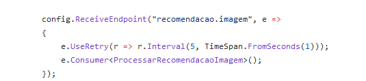
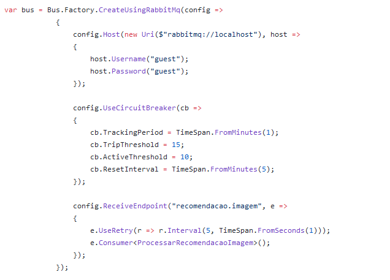

# Microserviços & RabbitMQ

## No inicio...

Temos uma api de visualizacao de imagens, que no início era assim:


Tudo ok. retorna uma imagem, bem simples ;)

## Novas features

Com a passagem do tempo, implementandos algumas features, basedas em rankings e recomendações:


## Sinal amarelo!

Agora nossa chamada esta fazendo coisas que nao importam muito para o cliente, pelo menos não em *tempo real*. todas essas ações podem sem feitas de maneira *assincrona*, liberando a chamada na api para fazer quase exclusivamente o cliente esta pedindo: retornar uma imagem.

Removendo essas lógicas de "relatórios", deixamos a api mais performática para o cliente e removemos algum pontos de falhas na api. Agora vamos começar a entrar nos *microserviços*.

## RabbitMQ

Então, o que faremos?

Quando for solicitado uma imagem, vamos disparar um *evento* chamado *VisualizacaoImagem*. esse evento será enviado para o rabbitmq, e outro servico irá *consumir* esse evento, processando todas as regras que removemos do fluxo da api.


nosso evento vai conter somente o ID da imagem (o nome no caso), que é o que nossos métodos precisam.


A nossa classe que vai processar o evento tem que implementar a interface *IConsumer*, passando o objeto que queremos processar.

## Configurando a solução até agora...

Vamos usar o cliente *Masstransit* para fazer a comunicação com rabbitmq, pois ele já vem com umas features bem legais que facilita bastante a vida:

Pacotes Nugets necessários:

```
<PackageReference Include="MassTransit" Version="7.0.6" />
<PackageReference Include="MassTransit.AspNetCore" Version="7.0.6" />
<PackageReference Include="MassTransit.RabbitMQ" Version="7.0.6" />
```

no *startup.cs* configuramos da seguiente maneira:


Com isso já é injentado a classe *IBusControl* no container do net core. Essa é a classe usada para enviar os eventos para o *broker* (RabbitMQ é um *Message Broker*), conforme o exemplo mais acima.

o nosso servico que irá consumir as mensagens será um *Console Application*, com os seguintes pacotes:

```
<PackageReference Include="MassTransit" Version="7.0.6" />
<PackageReference Include="MassTransit.RabbitMQ" Version="7.0.6" />
```

e com as seguintes configurações:


a configuração é semelhanta a da API, com a adição do *ReceiveEndpoint*, que configura a classe *ProcessarVisualizacaoImagem*, a qual possui todo lógica extraida da API:


## Escalabilidade horizontal

Também conseguimos escalar horizontalmente o processamento das regras. É so subir a mesma versão do nosso serviço.
Os dois serviços estarão escutando a mesma fila, e o próprio rabbitmq vai distribuir as mensagens para o consumidores de maneira adequada (*round-robin* por exemplo), atingindo um processamento paralelo.


o *broker* garante que a mesma mensagem não vai para o mesmo consumidor.

## Explicando melhor o RabbitMQ

Bom, agora vamos explicar um pouco melhor como funciona o rabbitmq e o masstransit.

Vamos subir um *rabbit* rapidamendo com docker:
```
docker run -p 5672:5672 -p 15672:15672 rabbitmq:3.8.9-management
```

A porta 5672 é usada para o envio e recebimento de mensagens, que já padrão no nosso cliente, enquanto a 15672 é UI.


Temos duas entidades principais, o *Exchange* e a *Queue*. Na hora de publicar uma mensagem, ela é publicada em um *Exchange*, e é ele que envia para a *Queue*.

Utilizando o *MassTransit*, já é criado um *Exchange* igual ao *namespace* do objeto de envio na hora que é publicada a mensagem. Quando um consumidor é conectado, é criada a fila configurada no *ReceiveEndpoint* (*visualicacao.imagem* no exemplo) e é feito também o *bind* com o exchange.

> _*o "grude" acontece pelo objeto da mensagem, que tem que ser igual, inclusive o namespace, no produtor e no consumidor, assim o consumidor sabe qual mensagem tem que processar, em um caso onde existe muitos tipo de mensagens*_

assim temos a *Queue*:


o *Exchange*:


e o *Binding*:


 e BOOM! começamos com uma *arquitetura orientada à eventos*, e processamento de forma *assincrona* e paralela. 

## Melhorando a arquitetura

Ok. Temos agora um processamento escalável de certas tarefas que podem ser executadas em segundo plano. Estamos entrando no mundo dos *microserviços*, mas esta faltando o *micro* ainda.

Olhando melhor a classe *ProcessarVisualizacaoImagem* notamos que ela esta com muitas reponsabilidades. Imagine um cenario que cada tarefa tem um time responsável. Teriamos quatro times desenvolvendo no mesmo projeto, podendo um interferir (bugar) no trabalho do outro.

Sendo assim, vamos dividir esse serviço em dois, um para gerenciar as recomendações e outro para as visualizações.

O nosso serviço de recomendação vai ter os seguientes metodos:


e vai apontar para *outra queue*, a *recomendacao.imagem* 

O outro serviço vai ficar com os métodos *AtualizarMinhasAvaliacoes* e *AtualizarMaisVistas* e vai se conectar na fila *visualizacao.imagem*


## Explicando melhor o RabbitMQ [2]

Ok, mas então a mesma mensagem tem que ir para dois serviços agora. 

Como explicamos antes, a mensagem é enviada para um *exchange* e ele envia para fila. Agora nos temos duas filas, e as duas tem a mesmo *bind* para o *exchange*, pois ele é definido pelo objeto, que ainda é mesmo para todos. E como o nosso *exchange* é do tipo *fanout* (o padrão do masstransit), ele envia a mensagem para *todas* as filas conectadas. 


Agora o pessoal que trabalha em um serviço não vai interfir no outro. #cadaUmComSeusBugs

Nos podemos agora dimensionar melhor o uso de recursos e escalar horizontalmente o servico necessaário:


Esse é o nosso caminho feliz, mas....

## E os erros?

O *masstransit* nos fornece umas features que facilitam o tratamento de erros. Vamos ver as *Retries* e o *CircuitBreaker*.

Quando acontece uma *exception* em nosso consumidor, a mensagem vai para uma fila *_error*, por exemplo:


Com as *retries* podemos configurar tentativas. por exemplo: 5 tentanticas em intervalos de 1 segundo. depois dessas tentativas, a mensagem vai para a fila de erro.



Outra feature interessante que podemos configurar é o *Circuit Breaker*. Esse padrão é muito importante para os microserviços. Basicamente, é monitorado o número de erros no servico, se a quantidade passa do valor estabelecido, o *circuito abre*, impedindo que requisições futuras, que possivelvente vão falhar, sobrecarregue o servico. Depois de um tempo determinado, e se não tiver mais erros acontecendo, o *circuito fecha*, voltando o fluxo normal.



## Sopa de letrinhas

bom, por enquanto é isso, um caso de uso explicando alguns conceito importantes. Para saber mais, procure esses tópicos:

* Rabbitmq (existem outros, como o Apache Kafka)
* Arquitetura orientada à eventos
* Sagas
* Escalabilidade Horizontal
* Circuit Breaker


